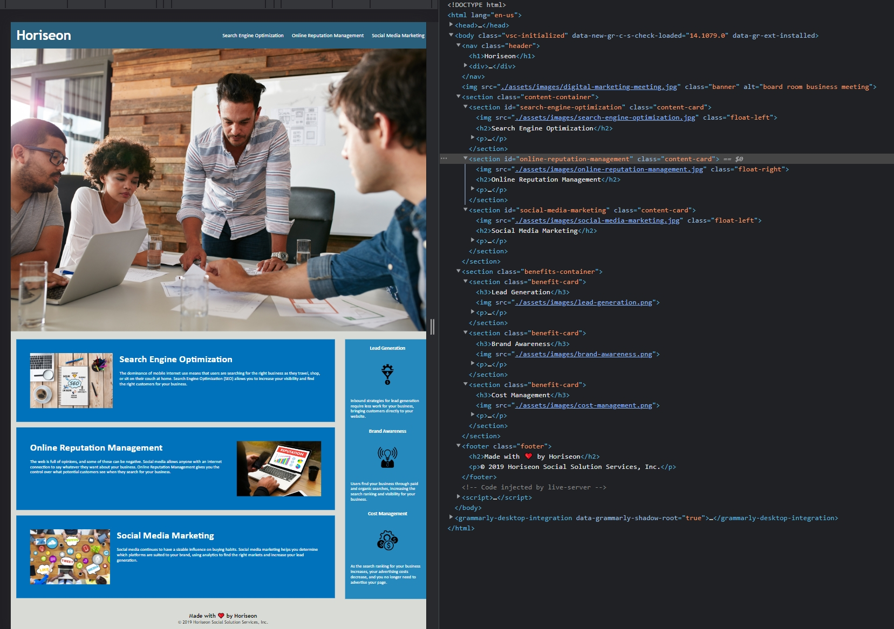

# 01 HTML, CSS, and Git: Code Refactor Challenge/Assignment

The following is my working screenshot of the refactored website. The semantics in the HTML has been added and CSS condensed.

Link to the working site: [Github Pages](https://roflmelon.github.io/utor-assignment1/)

